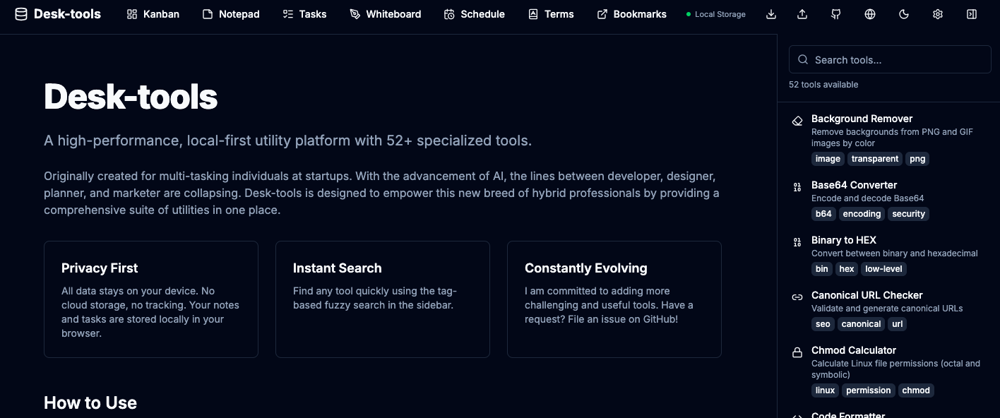

# Private Forge

The goal of this project is to create a collaborative environment where AIs with different strengths come together to achieve common goals across various domains of life and work.

## Project Structure

This repository is organized into four main pillars, each representing a key area of focus:

- **[Company](./Company):** Professional projects, business logic, and corporate tools.
  - **[Utils (Desk-tools)](./Company/Utils):** A local-first utility platform with 53+ tools for multi-tasking professionals.
- **[Study](./Study):** Educational resources, learning platforms, and skill development.
  - **[Security](./Study/Security):** Security research and toolsets.

## Featured Projects

### Desk-tools
A high-performance, local-first utility platform designed for multi-tasking individuals at startups. Built with Next.js 15 and React 19, it runs entirely in the browser with all data stored locally via IndexedDB.

 

- [README](./Company/Utils/README.md)
- **Key Features:** 50+ utilities (encoders, converters, formatters, generators, calculators, design tools), Kanban Board, Notepad, Whiteboard, local AI chat (Ollama), multi-language support (EN/KO/ZH/JA), and PWA support.

### English Study
An interactive English study platform designed for software engineers. It provides a structured environment for practicing listening, reading, writing, and speaking through AI-generated technical dialogues and documents.

 

- [README](./Study/English/README.md)
- **Key Features:** Multi-mode learning (Listening, Reading, Writing, Speaking), Study Calendar, and PWA support.

## Getting Started

Explore the directories to find specific tools and documentation for each project. Most sub-projects include their own detailed README files and setup instructions.

## License

This project is licensed under the Apache License 2.0. See the [LICENSE](LICENSE) file for details.

---
*This forge is a place for continuous building, learning, and collaboration between human and artificial intelligence.*
