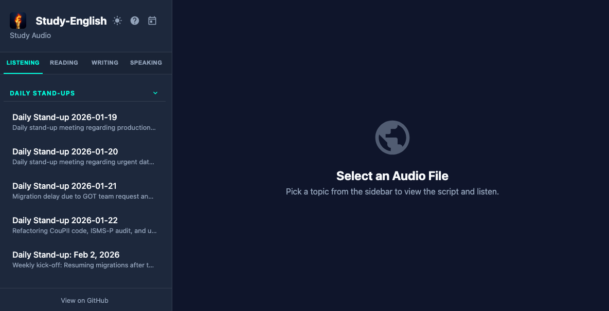
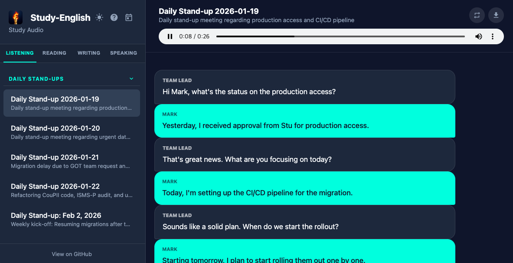
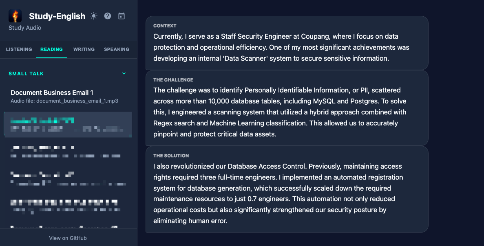
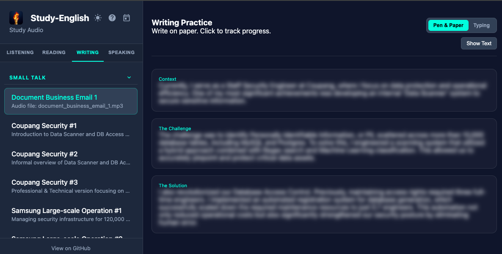
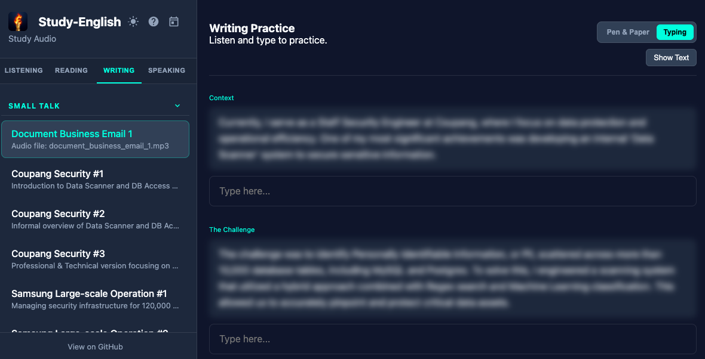
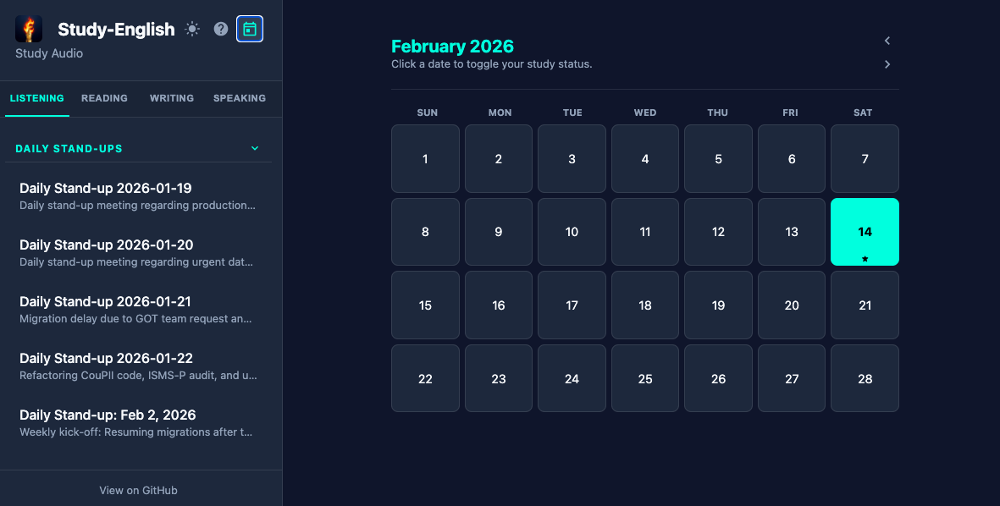
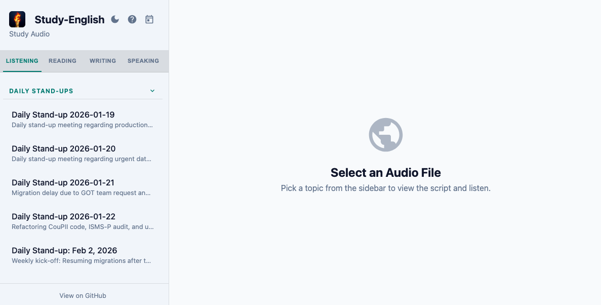
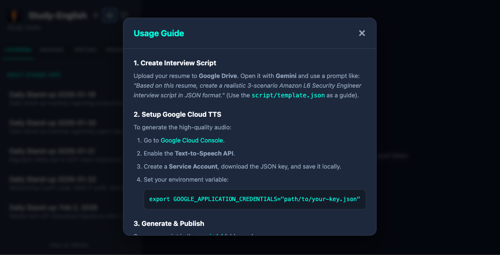

# Study-English

**Study-English** is an interactive English study platform designed for software engineers. It provides a structured environment for practicing listening, reading, writing, and speaking through AI-generated technical dialogues and documents.

## Live Demo

Access the study platform here: **[Study-English Web Player]



## Core Features

### 1. Multi-Mode Learning

- **Listening:** Audio playback with synchronized chat-style transcripts.
  

- **Reading:** Clean document view for studying technical scripts and articles.
  

- **Writing (Transcription):**
  - **Typing Mode:** Live transcription practice with text input.
  - **Pen & Paper Mode:** Progress tracking for physical writing practice with blur toggle for self-testing.
  
  *Blur toggle for self-testing:*
  

- **Speaking:** Real-time speech recognition with scoring based on text matching. Line-by-line practice with retry/next controls and session summary.

### 2. Study Calendar
IndexedDB-backed attendance tracking with monthly calendar view to mark study days.


### 3. Interactive Web UI
- **Dark/Light Mode Support:** Seamlessly switch between themes.
  
- **Collapsible Playlist Groups:** Category navigation for organized study materials.
- **Mobile-Responsive Sidebar:** Accessible hamburger menu for all devices.
- **In-App Usage Guide:** Integrated help for new users.
  

- **PWA Support:**
  - Installable as a standalone app on mobile and desktop.
  - Service Worker for offline support.
  - Media Session API for background playback and lock-screen controls.
- **Automated Workflow:**
  - High-quality audio generation using Google Cloud Text-to-Speech (Neural2).
  - Dynamic playlist generation from JSON scripts and metadata.

## Project Structure

```
study-English/
├── site/                       # Web application (deployed via GitHub Actions)
│   ├── index.html              # Main interface
│   ├── app.js                  # Application logic
│   ├── style.css               # Styling with dark/light themes
│   ├── playlist.js             # Auto-generated playlist data
│   ├── manifest.json           # PWA manifest
│   ├── sw.js                   # Service Worker for offline support
│   ├── icons/                  # PWA icons (192/512, maskable variants)
│   └── audio/                  # Audio assets and metadata
│       ├── *.mp3               # Generated audio files
│       ├── document/           # Document audio files
│       └── metadata.json       # Audio metadata mappings
├── script/                     # Source JSON transcripts
│   ├── *.json                  # Dialogue scripts (interviews, daily stand-ups, etc.)
│   ├── document/               # Document/reading material scripts
│   └── template.json           # Script schema reference
├── src/                        # Python utilities
│   ├── tts_generator.py        # Google Cloud TTS audio generation
│   ├── generate_playlist.py    # Playlist data synchronization
│   ├── generate_icons.py       # PWA icon generation
│   ├── cleanup_metadata.py     # Metadata management
│   └── create_silent_mp3.py    # Silent MP3 placeholder utility
├── images/                     # Screenshots and source images (app icon, favicon)
├── .github/workflows/          # GitHub Actions deployment
├── Makefile                    # Build automation
└── requirements.txt            # Python dependencies
```

## Usage

### 1. Script Creation
Create a JSON script in the `script/` directory following `script/template.json`.

### 2. Audio Generation
```bash
python3 src/tts_generator.py script/your_script.json --publish
```

### 3. Playlist Refresh
```bash
make refresh
```

### 4. Automated Deployment
Push changes to the `main` branch. GitHub Actions will automatically deploy the `site/` directory to GitHub Pages.

## Local Development

1. **Install Dependencies:**
   ```bash
   pip install -r requirements.txt
   ```

2. **Configure Google Cloud TTS:**
   ```bash
   cp .env.example .env
   # Edit .env with your service account key path
   ```

3. **Run Local Server:**
   ```bash
   cd site
   python3 -m http.server 8000
   ```

## Tech Stack

- **Frontend:** Vanilla JavaScript, CSS custom properties, Web APIs (Audio, Speech Recognition, IndexedDB, Service Workers)
- **Audio Generation:** Google Cloud Text-to-Speech (Neural2)
- **Deployment:** GitHub Actions + GitHub Pages

## License
This project is open-source.
